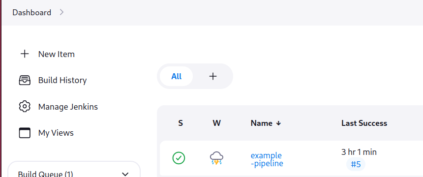
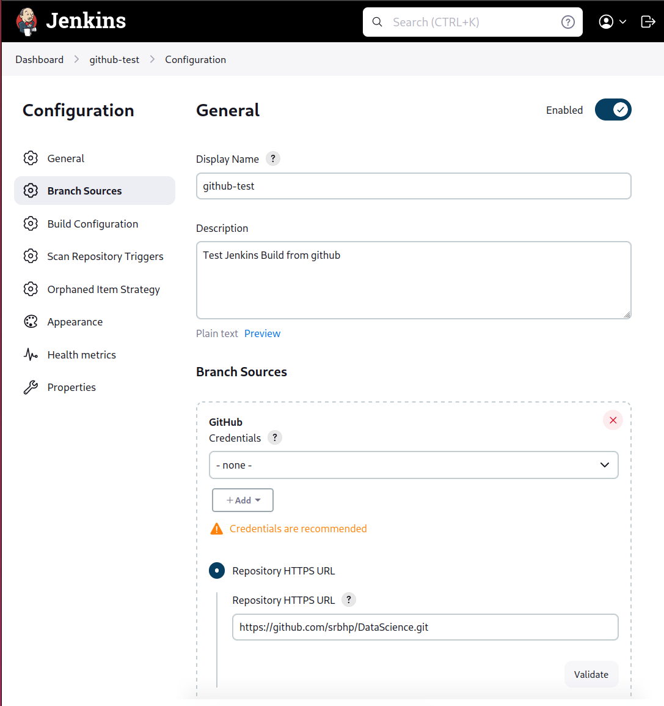

## Setup Jenkins  with docker

 - [x] Setting Up Continuous Integration with Jenkins
        - `docker run -p 8080:8080 -p 50000:50000 --restart=on-failure jenkins/jenkins:lts-jdk17`
        - open a `localhost:8080` in a browser
        - setup a user account from the web UI. 

### Run a Build from Jenkinsfile 
    
 - Create a Build 
    -  -> *Dashboard* -> *New Item*
    - Give a name for the build and select *Pipeline*
     
    - Write a example build Jenkinsfile  
     

 
### GitHub Branch Policies & Pipeline as Code with Jenkinsfile

 - Create a Build 
    -  -> *Dashboard* -> **New Item**
    - Give a name for the build and select *Multibranch Pipeline*
    -  Enter the github repo url   
        - Specify the `Jenkinsfile` path if not present in the root of the repo
         
    - Select `Periodically if not otherwise run` if you want it and select the `interval`
    - Now you can `Build Now` from the `Dashboard`


 - [X] Using Docker with Jenkins Pipelines

        - Build with a docker image

            ```
            agent { 
                # dockerfile true
                docker {
                    image "ubuntu:latest"
                }
            }
            ```
 - [ ] Docker Images
 - [ ] Launching a Multi-Service Application with Docker Compose
 - [ ] Automated Code Analysis
 - [ ] SRE and Deploying a Scalable Application to Kubernetes
 - [ ] SRE. GitOps and CD with Argo CD
